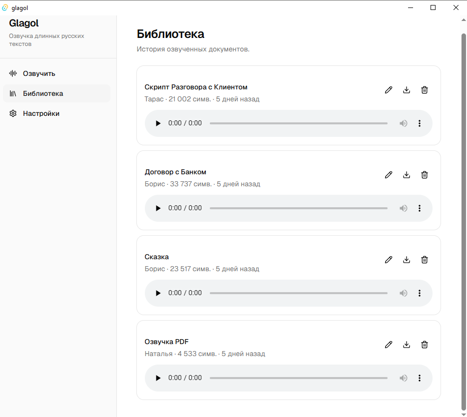

# 📖 Glagol

**Локальная озвучка и голосовой ввод на русском языке** · **Local Russian text-to-speech and voice dictation**

[Русский](#-русский) · [English](#-english) · [Disclaimer](#️-disclaimer--юридический-статус)

> ⚠️ **Glagol — независимый open source проект. Не аффилирован, не связан и не поддерживается ПАО Сбербанк.** Использует публичный API SaluteSpeech на условиях самого пользователя. Подробности — в [секции Disclaimer](#️-disclaimer--юридический-статус).

> 💼 **Доступен для контрактной работы** — десктоп-приложения на Rust/Tauri, voice/TTS/LLM-пайплайны. · **Available for contract work** — Rust/Tauri desktop apps, voice/TTS/LLM pipelines. — `kiss2tri@hotmail.com`

---

## 🇷🇺 Русский

📘 **[Руководство пользователя](USER_GUIDE.md)** · 📦 **[Скачать последний релиз](https://github.com/dimasiksuleyman-sudo/glagol/releases)**

### Что это?

**Glagol** — desktop-приложение для Windows, которое озвучивает длинные тексты и документы качественными русскими голосами и сохраняет аудио в локальную библиотеку, чтобы вы могли вернуться к прослушиванию когда угодно.

**Две функции:** озвучка текста (TTS) через SaluteSpeech API от Сбера и голосовой ввод (диктовка, STT) с автоматической вставкой в активное окно.

Glagol — бесплатное open source приложение (MIT). За распознавание и синтез вы платите провайдеру напрямую по своему ключу: озвучка — по подписке SaluteSpeech, диктовка — по потреблению (у большинства провайдеров — копейки за час аудио; у Groq есть бесплатный тариф с лимитами).

### Зачем?

Существующие решения для озвучки русских текстов имеют проблемы:

- 🌐 **Speechify, NaturalReader** — платные ($99–$330/год), слабые русские голоса
- 🎙️ **Balabolka** — бесплатный, но устаревшие SAPI-голоса
- 💻 **SaluteSpeech App от Сбера** — отличные голоса, но без библиотеки документов и кэша
- 🤖 **Яндекс.Браузер «Прочитать вслух»** — только в браузере, требует Яндекс-аккаунт

**Glagol сочетает лучшее:** качественные нейросетевые голоса Сбера, локальная библиотека прослушанных документов, резервное копирование — плюс голосовой ввод без системного VPN. Приложение бесплатно и с открытым кодом; за API вы платите провайдеру напрямую.

### Кому это нужно?

- 📚 **Читателям книг и статей**, которые хотят слушать вместо чтения
- 💼 **Менеджерам и юристам** с длинными документами и отчётами
- 👁️ **Людям со сниженным зрением**, которым нужна альтернатива чтению
- 🎓 **Студентам и исследователям**, чтобы слушать научные статьи
- 🎧 **Тем, кто переучивает мозг** воспринимать через аудио

### Что умеет

- 🎙️ **6 нейросетевых голосов** на русском — Наталья, Борис, Марфа, Тарас, Александра, Сергей
- 📋 **Вставка текста или загрузка файла** — TXT, Markdown, Word (`.docx`), PDF
- 📚 **Локальная библиотека** прослушанных документов с автоматическим сохранением
- ✏️ **Inline-переименование** документов прямо в библиотеке
- ▶️ **Воспроизведение** через нативный плеер с потоковой передачей из локального кэша
- 🎚️ **Скорость воспроизведения** 0.5x–2x
- 💾 **Экспорт аудио** в WAV-файл в любую папку
- 🗑️ **Управление библиотекой** — удаление документов одним кликом
- 💼 **Резервное копирование** — вся библиотека (документы + аудио) в один `.zip`-архив, удобно для бэкапа и переноса на другой компьютер
- 📊 **Счётчик использования** — сколько символов из бесплатного лимита потрачено в текущем месяце
- 🧹 **Гуманизация текста** — числа, даты, URL'ы, email и распространённые аббревиатуры (`т.е.`, `и т.д.`, `т.к.`) произносятся естественно, а не побуквенно
- 🔒 **Безопасность** — Authorization Key хранится в Windows Credential Manager, тексты не покидают вашу машину (кроме отправки в SaluteSpeech для синтеза)
- 🇷🇺 **Только русский.** Латиница и другие языки озвучиваются «на любителя» — это особенность SaluteSpeech

#### 🎤 Голосовой ввод (диктовка)

- ⌨️ **Push-to-talk диктовка** — зажмите хоткей, говорите, отпустите; текст сам появится в активном окне (Notepad, Chrome, Word, Telegram)
- 📋 **Автовставка или буфер** — на выбор: текст вставляется автоматически или копируется в буфер
- 🎹 **Настраиваемый хоткей** — по умолчанию `Ctrl+Shift+Space`, меняется на странице «Диктовка»
- 🎙️ **Выбор микрофона** из списка устройств
- 📝 **Локальная история** последних 10 расшифровок — по умолчанию **выключена**, тексты не касаются диска без необходимости
- 🌐 **Без системного VPN** — работает через провайдеров, доступных из РФ

### Что планируется

- 🖱️ **Drag & drop** файлов в окно
- ▶️ **Возобновление прослушивания** с точки остановки
- 🌙 **Тёмная и светлая темы**
- 🔍 **Поиск по библиотеке**
- 🔊 **Другие движки синтеза** — на рассмотрении

### Установка

1. Скачайте `Glagol_0.2.0_x64-setup.exe` из последнего [GitHub Release](https://github.com/dimasiksuleyman-sudo/glagol/releases) (~8 МБ, ~26 МБ после установки).
2. Запустите файл.

**При первом запуске Windows покажет предупреждение SmartScreen.** Поскольку установщик не подписан коммерческим сертификатом, Windows встретит вас синим окном «Система Windows защитила ваш компьютер». Это нормально для новых приложений:

1. Нажмите **«Подробнее»**.
2. Появится кнопка **«Выполнить в любом случае»** — нажмите её.
3. Откроется обычный установщик NSIS — стандартная установка (язык, лицензия MIT, папка, ярлыки). Права администратора не нужны — установка для текущего пользователя.

После установки запустите Glagol из меню «Пуск», в Настройках вставьте свой `Authorization Key` от SaluteSpeech (бесплатно на [developers.sber.ru/studio](https://developers.sber.ru/studio)) — и можно загружать документы.

Подробности — в **[Руководстве пользователя](USER_GUIDE.md)**.

### Технологический стек

- **Tauri 2.x** — фреймворк desktop-приложений
- **Rust** — backend (логика, парсинг, аудио)
- **React 19 + TypeScript** — frontend
- **Tailwind CSS + shadcn/ui** — стили и компоненты
- **SQLite** (через `rusqlite` + `rusqlite_migration`) — локальная база данных
- **Tauri Asset Protocol** — потоковая передача аудио из локального кэша
- **SaluteSpeech API** — синтез речи

### Дорожная карта

- [x] Sprint 0: Setup проекта
- [x] Sprint 1: Backend клиент SaluteSpeech + минимальный UI (`v0.1.0-alpha`)
- [x] Sprint 2: Локальное хранилище + UI библиотеки + asset protocol playback (`v0.1.0-rc.1`)
- [x] Sprint 3a: Препроцессор текста — URL/email/аббревиатуры/числа/даты (`v0.1.0-rc.2`)
- [x] Sprint 4: Парсинг файлов — TXT, MD, DOCX, PDF (`v0.1.0-rc.3`)
- [x] Sprint 5b: Inline-переименование + фокус MVP (`v0.1.0-rc.5`)
- [x] Sprint 5c: Резервное копирование и восстановление (`v0.1.0-rc.6`)
- [x] Sprint 5d: Счётчик символов + русские сообщения об ошибках (`v0.1.0-rc.7`)
- [x] Первый публичный релиз — `v0.1.0-rc.7`
- [x] **Sprint 6: Голосовой ввод — STT-клиент, рекордер, хоткей, автовставка, страница настроек (`v0.2.0`)**
- [ ] Иконки и миграция провайдеров
- [ ] **`v1.0.0`**

### Вклад в проект

Контрибьюторам рады! См. [CONTRIBUTING.md](CONTRIBUTING.md) и [CODE_OF_CONDUCT.md](CODE_OF_CONDUCT.md).

#### Где Glagol хранит данные

Дев-сборки (через `pnpm tauri dev`) и установленные через NSIS-установщик одинаково используют папку `%LOCALAPPDATA%\app.glagol.desktop\` для базы документов и аудио-кэша. Имя берётся из поля `bundle.identifier` в `src-tauri/tauri.conf.json` (исторически `app.glagol.desktop`; переименование в просто `Glagol` — техдолг, отложенный на будущий Sprint, чтобы не сломать существующие установки). Файл базы — `glagol.db`, аудио — в `audio_cache/{uuid}.wav`.

### Безопасность

Нашли уязвимость? Не открывайте публичный issue. См. [SECURITY.md](SECURITY.md).

---

## 🇬🇧 English

📘 **[User Guide](USER_GUIDE.md)** · 📦 **[Download latest release](https://github.com/dimasiksuleyman-sudo/glagol/releases)**

### What is it?

**Glagol** (Russian for "verb", "to speak") is a Windows desktop app that reads long texts and documents aloud using high-quality Russian neural voices, and saves audio to a local library so you can resume listening anytime.

**Two functions:** text-to-speech (TTS) via Sberbank's SaluteSpeech API, and voice dictation (STT) that types straight into your active window.

Glagol is free open source software (MIT). You pay the provider directly with your own key: TTS via a SaluteSpeech subscription, STT per-usage (pennies per audio-hour with most providers; Groq offers a free tier with limits).

### Why?

Existing Russian TTS solutions have gaps:

- 🌐 **Speechify, NaturalReader** — paid ($99–$330/year), weak Russian voices
- 🎙️ **Balabolka** — free but outdated SAPI voices
- 💻 **SaluteSpeech App by Sber** — great voices, no document library or cache
- 🤖 **Yandex Browser TTS** — only in the browser, requires a Yandex account

**Glagol combines the best:** quality neural voices from Sber, a local library of synthesized documents, backup/restore — plus voice dictation with no system VPN. The app is free and open source; you pay the API provider directly.

### Who is it for?

- 📚 **Readers** who'd rather listen than read off a screen
- 💼 **Managers and lawyers** with long documents and reports
- 👁️ **People with reduced vision** who need an alternative to reading
- 🎓 **Students and researchers** listening to papers
- 🎧 **Anyone retraining their brain** to absorb via audio

### What it does

- 🎙️ **6 Russian neural voices** — Natalya, Boris, Marfa, Taras, Aleksandra, Sergey
- 📋 **Paste text or load a file** — TXT, Markdown, Word (`.docx`), PDF
- 📚 **Local library** of synthesized documents with automatic saving
- ✏️ **Inline rename** of documents right in the library
- ▶️ **Playback** via native player streaming from a local cache
- 🎚️ **Playback speed** 0.5x–2x
- 💾 **Audio export** to a WAV file in any folder
- 🗑️ **Library management** — single-click deletion
- 💼 **Backup/restore** — the entire library (documents + audio) in one `.zip`, handy for backups and moving to another computer
- 📊 **Usage counter** — how many characters of your free monthly tier you've used
- 🧹 **Text humanization** — numbers, dates, URLs, emails, and common Russian abbreviations are spoken naturally, not letter-by-letter
- 🔒 **Security** — Authorization Key stored in Windows Credential Manager; your texts never leave your machine (except synthesis requests to SaluteSpeech)
- 🇷🇺 **Russian only.** Latin script and other languages come out "hit or miss" — that's a SaluteSpeech trait

#### 🎤 Voice dictation

- ⌨️ **Push-to-talk dictation** — hold the hotkey, speak, release; text appears in your active window (Notepad, Chrome, Word, Telegram)
- 📋 **Auto-paste or clipboard** — your choice
- 🎹 **Configurable hotkey** — `Ctrl+Shift+Space` by default, changeable on the Dictation page
- 🎙️ **Microphone selection** from the device list
- 📝 **Local history** of the last 10 transcripts — **off by default**, text never touches disk unless you opt in
- 🌐 **No system VPN** — works through providers reachable from Russia

### Planned

- 🖱️ **Drag & drop** files
- ▶️ **Resume playback** from where you stopped
- 🌙 **Dark and light themes**
- 🔍 **Library search**
- 🔊 **Additional synthesis engines** — under consideration

### Installation

1. Download `Glagol_0.2.0_x64-setup.exe` from the latest [GitHub Release](https://github.com/dimasiksuleyman-sudo/glagol/releases) (~8 MB, ~26 MB installed).
2. Run the file.

**Windows SmartScreen warning on first launch.** Because the installer isn't signed with a commercial certificate, Windows shows a blue "Windows protected your PC" dialog. This is normal for new apps:

1. Click **"More info"**.
2. A **"Run anyway"** button appears — click it.
3. The normal NSIS installer opens — standard flow (language, MIT license, folder, shortcuts). No administrator privileges needed — per-user install.

After installing, launch Glagol from the Start Menu, paste your SaluteSpeech `Authorization Key` in Settings (free at [developers.sber.ru/studio](https://developers.sber.ru/studio)), and you're ready to load documents.

Details in the **[User Guide](USER_GUIDE.md)**.

### Tech Stack

- **Tauri 2.x** — desktop framework
- **Rust** — backend
- **React 19 + TypeScript** — frontend
- **Tailwind CSS + shadcn/ui** — styling
- **SQLite** (via `rusqlite` + `rusqlite_migration`) — local database
- **Tauri Asset Protocol** — streaming audio playback from local cache
- **SaluteSpeech API** — speech synthesis

### Contributing

Contributions welcome! See [CONTRIBUTING.md](CONTRIBUTING.md) and [CODE_OF_CONDUCT.md](CODE_OF_CONDUCT.md).

#### Where Glagol stores data

Both dev builds (`pnpm tauri dev`) and NSIS-installed builds use `%LOCALAPPDATA%\app.glagol.desktop\` for the document database and audio cache. The folder name comes from `bundle.identifier` in `src-tauri/tauri.conf.json` (historically `app.glagol.desktop`; renaming to plain `Glagol` is tracked as tech debt for a future Sprint so existing installations don't lose their libraries). The database file is `glagol.db`; audio lives under `audio_cache/{uuid}.wav`.

### Security

Found a vulnerability? Don't open a public issue. See [SECURITY.md](SECURITY.md).

---

## ⚖️ Disclaimer / Юридический статус

### 🇷🇺 Русский

**Glagol — независимый open source проект**, созданный сообществом разработчиков (Glagol Contributors) и распространяемый под лицензией MIT.

Проект **НЕ является:**

- ❌ Официальным продуктом ПАО Сбербанк или его дочерних компаний
- ❌ Аффилированным с ПАО Сбербанк, SberDevices, SaluteSpeech или их сотрудниками
- ❌ Финансируемым, поддерживаемым или одобренным Сбером

**Проект использует** публичный API сервиса SaluteSpeech, доступный любому пользователю на условиях [Лицензионного соглашения](https://developers.sber.ru/docs/ru/policies/overview) и [Политики обработки персональных данных](https://developers.sber.ru/docs/ru/policies/privacy-policy) ПАО Сбербанк. Каждый пользователь Glagol самостоятельно регистрируется на [developers.sber.ru](https://developers.sber.ru) и получает свои собственные авторизационные данные.

**Товарные знаки.** «SaluteSpeech», «Сбер», «SberDevices» и связанные обозначения являются товарными знаками ПАО Сбербанк или связанных лиц. Упоминание этих знаков в проекте Glagol носит **исключительно информационный характер** в рамках добросовестного использования (fair use) и описания совместимости.

**Ответственность.** Программное обеспечение распространяется «как есть» (AS IS) без каких-либо гарантий. Разработчики Glagol не несут ответственности:

- За работоспособность API SaluteSpeech и изменения в его условиях
- За расходы пользователя, превысившие бесплатный лимит SaluteSpeech
- За соблюдение пользователем авторских прав на тексты, которые он озвучивает
- За использование сгенерированного аудио в коммерческих целях (правила определяются лицензией SaluteSpeech)

**Контакты для вопросов по API SaluteSpeech:** обращайтесь напрямую в Сбер — `SaluteSpeech@sberbank.ru` или через форму поддержки на developers.sber.ru.

### 🇬🇧 English

**Glagol is an independent open source project** developed by community contributors (Glagol Contributors) and distributed under the MIT License.

**This project is NOT:**

- ❌ An official product of PJSC Sberbank or its subsidiaries
- ❌ Affiliated with PJSC Sberbank, SberDevices, SaluteSpeech, or their employees
- ❌ Funded, supported, or endorsed by Sberbank in any way

**The project uses** the public SaluteSpeech API, available to any user under the terms of [PJSC Sberbank's License Agreement](https://developers.sber.ru/docs/ru/policies/overview). Each Glagol user independently registers at [developers.sber.ru](https://developers.sber.ru) and obtains their own credentials.

**Trademarks.** "SaluteSpeech", "Sber", "SberDevices", and related marks are trademarks of PJSC Sberbank or affiliated entities. Their use in this project is **for informational and interoperability purposes only** under fair use principles.

**Liability.** The software is provided "AS IS" without warranty of any kind. Glagol contributors are not responsible for:

- The operability or terms of the SaluteSpeech API
- Costs incurred by users exceeding SaluteSpeech free tier limits
- Copyright compliance for texts users choose to synthesize
- Commercial use of generated audio (governed by SaluteSpeech license)

**Contact for SaluteSpeech API questions:** Contact Sberbank directly — `SaluteSpeech@sberbank.ru` or via developers.sber.ru support.

---

**Создано Дмитрием в паре с Claude (Anthropic) — ИИ как инструмент под человеческим контролем**
**Built by Dmitriy together with Claude (Anthropic) — AI as a tool under human control**

[Сообщить о баге](https://github.com/dimasiksuleyman-sudo/glagol/issues/new) ·
[Предложить фичу](https://github.com/dimasiksuleyman-sudo/glagol/issues/new) ·
[Обсуждения](https://github.com/dimasiksuleyman-sudo/glagol/discussions)

💼 **Доступен для контрактной работы / Available for contract work** — `kiss2tri@hotmail.com`
Rust/Tauri desktop · voice/TTS/LLM pipelines

