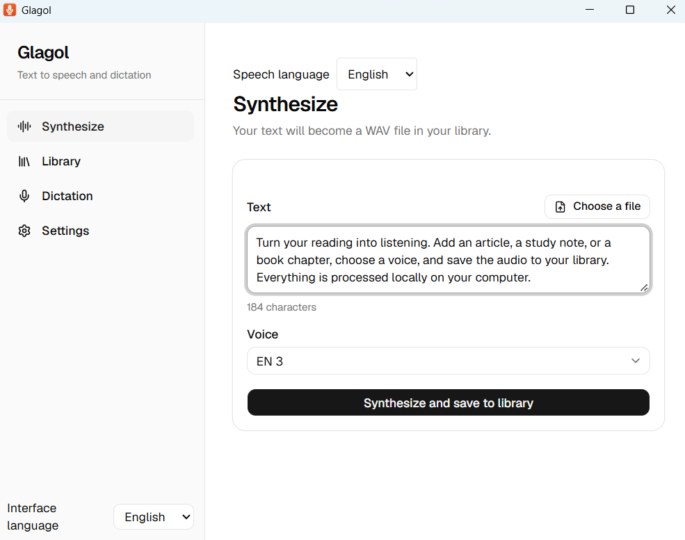
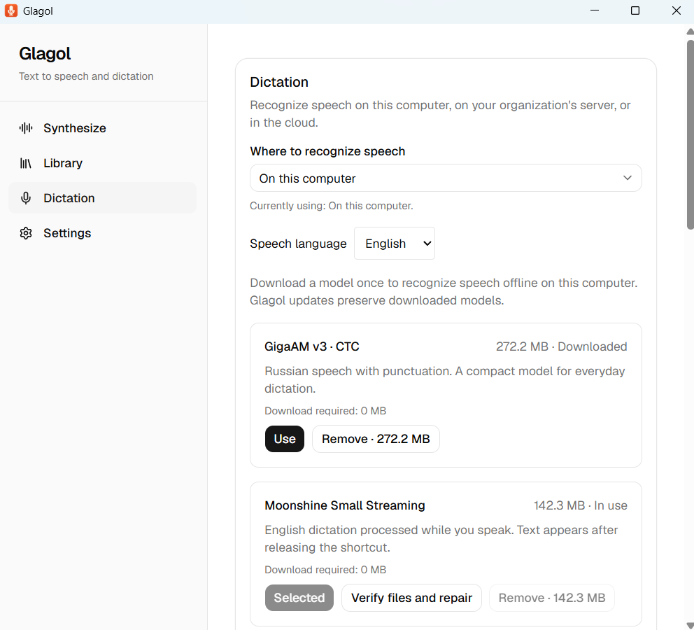
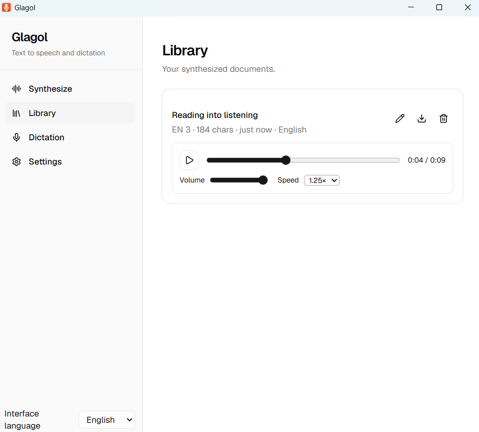
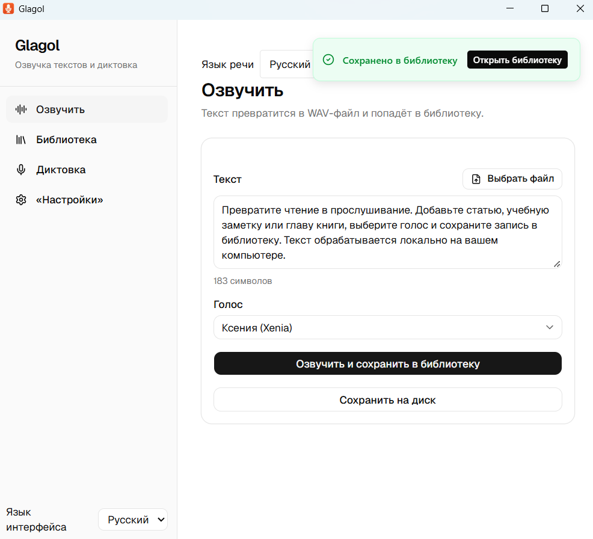

# Glagol

Offline English and Russian dictation and text-to-speech for Windows 10/11 x64.
Диктовка и озвучка на английском и русском для Windows 10/11 x64.

[English guide](USER_GUIDE.en.md) · [Руководство](USER_GUIDE.ru.md) · [MIT application](LICENSE) · [Security](SECURITY.md)

**Download Glagol 0.5.0 / Скачать Глагол 0.5.0:**
[Windows x64 installer](https://github.com/dimasiksuleyman-sudo/glagol/releases/download/v0.5.0/Glagol_0.5.0_x64-setup.exe)
([release notes and SHA-256](docs/releases/v0.5.0.md), 9,947,426 bytes).

## English

### See Glagol

**Turn text into a recording.** English interface and English speech, with a
demonstration text ready to synthesize.

**Dictate offline in English.** Select Moonshine Small Streaming; downloaded
models stay on your computer.

**Keep recordings in your library.** Resume playback, adjust the speed and export
audio as WAV.

[View all 0.5.0 screenshots — synthesis, dictation and library, including Russian](docs/screenshots/0.5.0/README.md).

### Languages and speech

Choose **English / Русский** on first launch, including the first upgrade to 0.5.0.
Interface, dictation and synthesis languages are independent. Change the interface
in the app shell or Settings without restarting; change speech languages on their
own pages. Each language remembers its model and voice. New installs start with
local dictation. Upgrades retain modes, server addresses, credentials and voices.

- Hold `Ctrl+Shift+Space`, wait for the recording signal, speak, release, then receive
  the final text once. Auto-paste or clipboard only; optional history is off by default.
- English local dictation: Moonshine Small Streaming, native CPU runtime. Russian:
  GigaAM v3 CTC/RNNT. Independent office-server and cloud profiles remain available.
- Optional offline Silero synthesis: v3_en with EN 0–3 (default EN 0), and v5.5 RU
  with Aidar, Baya, Kseniya, Xenia and Eugene. Voice preview, progress and cancellation.
- Paste text or import TXT/MD/DOCX/PDF. Long documents use a sequential WAV pipeline.
  Library, rename, localized player, 0.5–2× playback, WAV export and backups.
  Existing recordings and their metadata remain usable.

### Install only the components you need

One compact installer, with English/Russian installation and removal. The language
selector starts from Windows' language, with English fallback. No speech weights,
speech ONNX runtime, Python/PyTorch or pronunciation dictionaries are bundled.
First-run speech setup can be skipped. Choosing a language never downloads files
or accepts a model license.

| Optional component | First download | With its shared runtime already installed |
|---|---:|---:|
| English dictation | 158.8 MB | 142.3 MB model |
| Russian dictation | 292.2–293.8 MB | 272.2–273.7 MB model |
| English Silero TTS | 306.5 MB | **57.2 MB model** |
| Russian Silero TTS | 394.8 MB | 145.4 MB model |

Sizes use decimal MB; the app accounts for installed files. Both Silero languages
share one 249.3 MB Python/PyTorch download. Allow 1.9 GB for initial Silero installation
and staging. No system Python, pip, CUDA or SAPI setup. Downloads support cancellation,
resume and integrity checks. Importing the exact model file is available when the
Silero server cannot be reached. Removing one model retains the shared runtime.

Silero retains a full-verification receipt for 30 days; changed key files, an expired
receipt or worker failure trigger a full check. Workers stay warm and unload after
15 idle minutes. Installed local speech works offline. Speech languages are selected
explicitly: mixed-language detection and translation are not provided locally.

### Licenses and data

Glagol is free and MIT licensed. Dictation can be used in organizations, subject to
each model/service's terms. Moonshine English streaming and GigaAM models are MIT.
**Both Russian and English Silero models are optional, noncommercial CC BY-NC-SA 4.0
components**, by Silero Team. Separate downloads do not waive those terms.
[Silero license](docs/third-party/Silero-LICENSE.txt) · [Moonshine notices](docs/third-party/Moonshine-LICENSE.txt).
Glagol is independent of its model and service providers. Cloud services have their
own terms and charges; no commercial TTS provider is integrated in this version.

Data stays in `%LOCALAPPDATA%\app.glagol.desktop\`: `glagol.db`, `audio_cache`,
`speech_models`, `tts_models`. Library backups exclude models, runtime, OS credentials
and Silero consent. User text, document names and old history are never translated
when changing the interface language.

### Development and validation

Tauri 2, Rust, React 19, TypeScript, SQLite. `pnpm install --frozen-lockfile`,
`pnpm tauri build`. [Architecture](PROJECT_STRUCTURE.md), [contributing](CONTRIBUTING.md),
[Windows checks](docs/runbooks/windows-build.md), [TTS runtime](docs/local-tts-runtime.md),
[STT runtime](docs/local-dictation-runtime.md), [changelog](CHANGELOG.md).
Current implementation evidence and unperformed manual checks are recorded in the
[0.5.0 workstream](docs/workstreams/english-first/log.md). Synthetic audio tests are
not a listening-quality result. Direct Silero-origin delivery was unavailable from
the development machine; importing pinned files was exercised separately.

## Русский

### Как выглядит Глагол

**Превратите текст в запись.** Русский интерфейс и русская озвучка:
демонстрационная запись сохранена в библиотеку и доступна для экспорта.

**Диктуйте на английском без интернета.** Выберите Moonshine Small Streaming;
скачанные модели остаются на компьютере. **Храните записи в библиотеке:**
продолжайте прослушивание, меняйте скорость и экспортируйте WAV.
Английские экраны диктовки и библиотеки показаны выше.

[Все скриншоты 0.5.0 — озвучка, диктовка и библиотека, включая русский интерфейс](docs/screenshots/0.5.0/README.md).

### Языки и речь

При первом запуске, включая первое обновление до 0.5.0, выберите **English / Русский**.
Языки интерфейса, диктовки и озвучки независимы. Интерфейс переключается в оболочке
или настройках без перезапуска; речь — на своей странице. Для каждого языка
сохраняются модель и голос. Новая установка начинает с локальной диктовки;
обновление сохраняет режимы, адреса серверов, ключи и голоса.

- Удерживайте `Ctrl+Shift+Space`, дождитесь сигнала записи, говорите и отпустите:
  готовый текст вставится один раз. Доступен режим буфера; история изначально выключена.
- Английская локальная диктовка: Moonshine Small Streaming, нативный CPU-runtime.
  Русская: GigaAM v3 CTC/RNNT. Сохраняются отдельные офисный и облачный профили.
- Необязательная офлайн-озвучка Silero: v3_en с EN 0–3 (по умолчанию EN 0) и
  v5.5 RU с Айдаром, Баей, Ксенией, Xenia и Евгением. Есть образец голоса, прогресс и отмена.
- Текст или TXT/MD/DOCX/PDF; последовательная озвучка длинных документов в WAV.
  Библиотека, переименование, локализованный плеер, скорость 0.5–2×, экспорт и бэкапы.
  Старые записи и метаданные остаются доступны.

### Только нужные компоненты

Один компактный установщик, установка и удаление на EN/RU. Начальный язык — по
Windows, резервный — английский. В установщике нет речевых весов, речевого ONNX-runtime,
Python/PyTorch и словарей произношения. Начальную настройку речи можно пропустить.
Выбор языка сам ничего не скачивает и не принимает лицензию.

| Необязательный компонент | Первая загрузка | Общий runtime уже установлен |
|---|---:|---:|
| Английская диктовка | 158,8 МБ | 142,3 МБ модель |
| Русская диктовка | 292,2–293,8 МБ | 272,2–273,7 МБ модель |
| Английская Silero | 306,5 МБ | **57,2 МБ модель** |
| Русская Silero | 394,8 МБ | 145,4 МБ модель |

МБ — десятичные; приложение учитывает установленные файлы. У обоих языков Silero
один runtime Python/PyTorch, 249,3 МБ загрузки. Для первой установки и временных
файлов освободите 1,9 ГБ. Системные Python, pip, CUDA и SAPI не нужны.
Есть отмена, продолжение и проверка загрузки, импорт точного файла модели при
недоступности сервера Silero. Удаление одной модели сохраняет общий runtime.

Отметка полной проверки Silero действует 30 дней; истечение срока, изменение
ключевых файлов или ошибка worker вызывают полный контроль. Прогретый worker
выгружается через 15 минут простоя. Установленная локальная речь работает без сети.
Язык выбирается явно; локального автоопределения смешанной речи и перевода нет.

### Лицензии и данные

Глагол бесплатен, код — MIT. Диктовка доступна организациям с учётом условий
выбранной модели/сервиса. Moonshine English streaming и GigaAM — MIT.
**Обе модели Silero, русская и английская, — необязательные компоненты для
некоммерческого использования под CC BY-NC-SA 4.0**, Silero Team. Раздельная
загрузка не отменяет условий. [Лицензия](docs/third-party/Silero-LICENSE.txt),
[уведомления Moonshine](docs/third-party/Moonshine-LICENSE.txt). Глагол независим
от поставщиков. У облачных сервисов свои условия и тарифы; коммерческого TTS
в этой версии нет.

Данные: `%LOCALAPPDATA%\app.glagol.desktop\`: `glagol.db`, `audio_cache`,
`speech_models`, `tts_models`. Бэкап библиотеки не переносит модели, runtime,
OS-ключи и согласие Silero. При смене интерфейса тексты пользователя, названия
документов и прежняя история не переводятся.

### Разработка и проверка

Текущая версия — **0.5.0**. Установщик по ссылке сверху — 9 947 426 байт.
Стек: Tauri 2, Rust,
React 19, TypeScript, SQLite. `pnpm install --frozen-lockfile`, `pnpm tauri build`.
[Архитектура](PROJECT_STRUCTURE.md), [вклад](CONTRIBUTING.md),
[проверки Windows](docs/runbooks/windows-build.md), [TTS runtime](docs/local-tts-runtime.ru.md),
[STT runtime](docs/local-dictation-runtime.md), [изменения](CHANGELOG.md).
Результаты 0.5.0 и недоступные ручные проверки — в [журнале](docs/workstreams/english-first/log.md).
Синтетические WAV не подтверждают качество на слух. Прямой сервер Silero с
машины разработки был недоступен; импорт закреплённых файлов проверен отдельно.

Available for contract work / Доступен для контрактной работы — Rust/Tauri,
voice/TTS/LLM applications: `kiss2tri@hotmail.com`.
