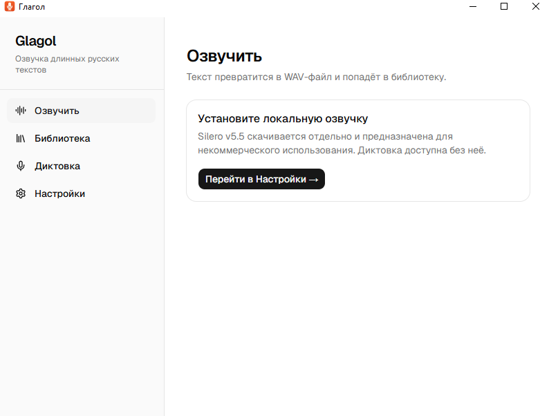

# Глагол / Glagol

Диктовка и локальная озвучка русских текстов для Windows 10/11 x64.
Russian dictation and local text-to-speech for Windows 10/11 x64.

[MIT — приложение / application](LICENSE) · [Руководство / Guide](USER_GUIDE.md) · [Релизы / Releases](https://github.com/dimasiksuleyman-sudo/glagol/releases) · [Безопасность / Security](SECURITY.md)

**[Скачать / Download Glagol 0.4.0 — Windows x64](https://github.com/dimasiksuleyman-sudo/glagol/releases/download/v0.4.0/Glagol_0.4.0_x64-setup.exe)** · [Что нового / Release notes](docs/releases/v0.4.0.md)

## Русский

### Использование в организациях и лицензии

**Глагол можно использовать для диктовки, в том числе в организации.**
Локальная GigaAM, свой офисный сервер и облачный STT настраиваются независимо
от озвучки. Условия выбранного провайдера/модели действуют отдельно.

**Озвучка Silero TTS v5.5 — необязательный компонент для некоммерческого
использования**, CC BY-NC-SA 4.0, Silero Team. Модель и движок скачиваются
только по выбору пользователя после ознакомления с условиями. Они не входят
в установщик, не загружаются при обновлении и не нужны для диктовки.
Отдельное скачивание не отменяет ограничений лицензии.
[Полная лицензия](docs/third-party/Silero-LICENSE.txt) · [Silero](https://github.com/snakers4/silero-models).

Сам Глагол остаётся MIT-проектом. Для коммерческой озвучки позже планируется
**Yandex SpeechKit v3**; в 0.4.0 его интеграции ещё нет. Интеграция SaluteSpeech
удалена. Глагол — независимый проект, не аффилированный с поставщиками моделей.

### Возможности

- Диктовка по хоткею `Ctrl+Shift+Space`: дождитесь сигнала записи после подготовки
  микрофона, говорите, отпустите. Автовставка в активное окно или буфер обмена.
- Локальная GigaAM v3 CTC/RNNT с загрузкой по выбору: 272–274 МБ и движок около
  20 МБ. Модели MIT, авторство [Sber GigaAM](https://github.com/salute-developers/GigaAM)
  и лицензия сохраняются; удаление SaluteSpeech их не затрагивает.
- Офисный OpenAI-совместимый сервер для нескольких компьютеров; отдельный ключ
  и настройки. Облачный STT имеет собственный профиль, модель и прокси.
- Необязательная локальная история диктовок; по умолчанию выключена.
- Пять голосов Silero: Айдар, Бая, Ксения, Xenia, Евгений. Предпрослушивание,
  ударения, вопросительные фразы, преобразование чисел и латинских сокращений.
- Вставка текста или TXT/MD/DOCX/PDF; длинные документы озвучиваются по частям
  с прогрессом и отменой, без накопления всей аудиокниги в памяти.
- Локальная библиотека, переименование, плеер, скорость 0.5–2×, экспорт WAV,
  резервные копии. Старые озвучки продолжают воспроизводиться.

### Установка и первый запуск

Текущий выпуск — **0.4.0**: [установщик Windows x64](https://github.com/dimasiksuleyman-sudo/glagol/releases/download/v0.4.0/Glagol_0.4.0_x64-setup.exe), **9,29 МиБ**. [SHA-256 и подробности выпуска](docs/releases/v0.4.0.md). Установщик не подписан; SmartScreen может показать предупреждение — см. [руководство](USER_GUIDE.ru.md#установка).

1. Запустите `Glagol_<версия>_x64-setup.exe` и прочитайте пояснение о компонентах.
2. Для диктовки выберите локальную модель, офисный сервер или облако в настройках.
3. Для некоммерческой озвучки откройте «Локальная озвучка — Silero v5.5»,
   ознакомьтесь с лицензией и нажмите «Скачать и включить».
4. Если сервер модели недоступен, можно выбрать заранее скачанный
   `v5_5_ru.pt`; приложение проверит его размер и SHA-256.

Silero: модель **145,4 МБ** + runtime **249,3 МБ**, суммарно **394,8 МБ**
загрузки. Освободите не менее **1,9 ГБ** для установки и временных файлов.
Системные Python/pip/CUDA и регистрация SAPI не нужны. После загрузки синтез
работает без сети. На Ryzen 7 7730U / 16 ГБ проверен CPU-режим с двумя потоками;
на других машинах скорость зависит от CPU и доступной памяти.

Числа преобразуются в слова; даты и дроби могут читаться по компонентам,
неизвестные латинские слова — по буквам. Проверяйте важные тексты на слух.
Нет обещания грамматически идеального чтения произвольных обозначений.

Данные: `%LOCALAPPDATA%\app.glagol.desktop\`. Библиотека — `audio_cache` и
`glagol.db`, STT-модели — `speech_models`, Silero — `tts_models`.
Бэкап библиотеки не переносит модели, runtime, OS-ключи и подтверждение условий
Silero. На другом ПК компонент включается отдельно.

### Обновление с 0.2.1 и проверка

Создайте бэкап библиотеки, завершите приложение через трей и запустите установщик
0.4.0. На экране существующей установки выберите «Не удалять» и прежнюю папку.
0.3.0 отдельно не публиковалась; её изменения включены в этот выпуск.

На Windows 10 / AMD FX-8300 / 16 ГБ проверены чистая установка, обновление
с сохранением пяти записей и STT-настроек, бэкап/восстановление, скачивание Silero,
пять голосов, короткий синтез и экспорт WAV. Ручной прогон приостановлен:
длинный синтез, оставшиеся проверки компонентов и живая диктовка после обновления
ещё не завершены. [Покрытие и ограничения](docs/releases/v0.4.0.md#проверено-и-что-осталось) ·
[Скриншоты установки](docs/screenshots/windows10-0.4.0/README.md).

### Разработка

Tauri 2, Rust, React 19, TypeScript, SQLite. [Структура](PROJECT_STRUCTURE.md),
[вклад в проект](CONTRIBUTING.md), [TTS runtime](docs/local-tts-runtime.ru.md),
[STT runtime](docs/local-dictation-runtime.md), [изменения](CHANGELOG.md).
Сборка: `pnpm install`, `pnpm tauri build`. Проверка версий:
`node scripts/check-version.mjs`.

## English

### Organization use and licenses

**Glagol can be used for dictation in organizations.** Local GigaAM, your office
server and cloud STT are independent of TTS. Each provider/model's own terms apply.

**Silero TTS v5.5 is optional and for noncommercial use**, CC BY-NC-SA 4.0,
Silero Team. Model/runtime download only after the user chooses the component
and acknowledges its terms. They are excluded from the installer and updates;
dictation does not require them. Separate downloads do not waive license terms.
[Full license](docs/third-party/Silero-LICENSE.txt) · [Silero](https://github.com/snakers4/silero-models).

Glagol itself remains MIT licensed. **Yandex SpeechKit v3** for commercial TTS
is planned for a later stage and is not integrated in 0.4.0. SaluteSpeech has
been removed. Glagol is independent of its model/service providers.

### Features

- Push-to-talk with `Ctrl+Shift+Space`; wait for the recording signal after
  microphone preparation. Auto-paste into the active window or copy to clipboard.
- Optional local GigaAM v3 CTC/RNNT: 272–274 MB plus a roughly 20 MB runtime.
  [Sber GigaAM](https://github.com/salute-developers/GigaAM) attribution and MIT
  license remain; removing SaluteSpeech does not remove local dictation.
- Shared OpenAI-compatible office server and a separate cloud STT profile,
  model, credentials and proxy. Dictation history is optional and off by default.
- Five Silero voices, preview, stress/question support, number/Latin conversion.
- Paste text or import TXT/MD/DOCX/PDF; long documents process sequentially with
  progress and cancellation, without buffering an entire audiobook in memory.
- Local library, rename, player, 0.5–2× speed, WAV export and backups. Existing
  audio remains playable after the update.

### Installation

Current release: **0.4.0**, [Windows x64 installer](https://github.com/dimasiksuleyman-sudo/glagol/releases/download/v0.4.0/Glagol_0.4.0_x64-setup.exe), **9.29 MiB**. [SHA-256 and release notes](docs/releases/v0.4.0.md). The installer is unsigned; SmartScreen may warn — see the [guide](USER_GUIDE.en.md#installation).
Run `Glagol_<version>_x64-setup.exe`, read the component information, then
choose local, office-server or cloud dictation in Settings. For noncommercial
TTS, read Silero's terms and choose its separate download. If its server is
unreachable, select a previously downloaded `v5_5_ru.pt`; size/SHA-256 are checked.

Silero downloads: **145.4 MB model + 249.3 MB runtime = 394.8 MB**.
Allow at least **1.9 GB** for installation/staging. No system Python, pip,
CUDA or SAPI registration. Synthesis is offline after installation. CPU mode
with two threads was tested on Ryzen 7 7730U / 16 GB; performance varies.

Numbers become words; dates/fractions may be read component by component and
unknown Latin words are spelled out. Listen to important text; arbitrary
notation is not guaranteed to be read with perfect grammar.

Data: `%LOCALAPPDATA%\app.glagol.desktop\`; `audio_cache`/`glagol.db` for the
library, `speech_models` for STT, `tts_models` for Silero. Library backups exclude
models/runtime, OS credentials and Silero acknowledgement. Enable TTS separately
on another computer.

### Upgrade from 0.2.1 and verification

Back up the library, exit through the tray menu and run the 0.4.0 installer.
Choose “Do not uninstall” on the existing-installation page and retain the original
directory. Version 0.3.0 was unpublished; its changes are included in this release.

Windows 10 / AMD FX-8300 / 16 GB testing confirmed clean installation, upgrade
preserving five recordings and STT settings, backup/restore, Silero download,
five voices, short synthesis and WAV export. Manual testing is paused: long
synthesis, remaining component checks and live dictation after updating are
not yet complete. [Coverage and limits](docs/releases/v0.4.0.md#verification-and-remaining-coverage) ·
[Installation screenshots](docs/screenshots/windows10-0.4.0/README.md).

### Development

Tauri 2, Rust, React 19, TypeScript, SQLite. [Contributing](CONTRIBUTING.md),
[TTS runtime](docs/local-tts-runtime.md), [STT runtime](docs/local-dictation-runtime.md),
[changelog](CHANGELOG.md). Build with `pnpm install` and `pnpm tauri build`;
check version consistency with `node scripts/check-version.mjs`.

Доступен для контрактной работы / Available for contract work — Rust/Tauri,
voice/TTS/LLM applications: `kiss2tri@hotmail.com`.
