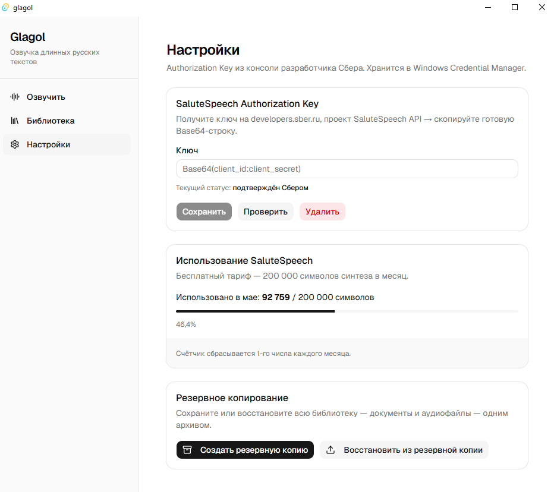
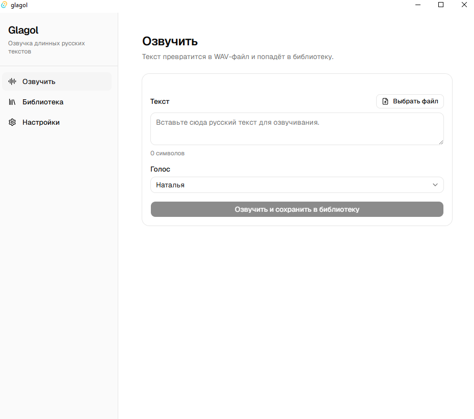

# User Guide — Glagol

Glagol turns long Russian texts into audio. Paste text or load a file — get a recording in a professional voice that you can listen to anywhere: on a walk, on the road, while doing chores.

Built for people who'd rather listen than read off a screen. If you love audiobooks but want to listen to *your own* documents — articles, contracts, books in PDF — Glagol is made for exactly that.

> **Note:** Glagol synthesizes **Russian** text. It runs on Sber's SaluteSpeech, a Russian-language TTS service. Latin script and other languages come out "hit or miss." This is a Russian-first product by design.

---

## Installation

1. Download `Glagol_0.1.0_x64-setup.exe` from the [Releases page](../../releases).
2. Run the installer.
3. Windows will show a SmartScreen warning ("Windows protected your PC"). This is normal for new apps without a commercial signing certificate. Click **"More info"** → **"Run anyway"**.
4. Done — Glagol launches automatically.

**What you need:**
- Windows 10 or 11 (64-bit)
- ~26 MB on disk
- A free SaluteSpeech key from Sber (how to get one — below)
- Internet (synthesis runs through Sber's cloud)

---

## Setting up your SaluteSpeech key

Glagol uses Sber's SaluteSpeech for speech synthesis. To get it working you need a free key.

1. Go to [developers.sber.ru](https://developers.sber.ru), create a **SaluteSpeech API** project.
2. Copy the ready-made **Authorization Key** string (it's Base64 of `client_id:client_secret`).
3. In Glagol, open **Settings** → paste the key into the **SaluteSpeech Authorization Key** field → **Save**.
4. Click **Verify** — the status should change to "confirmed by Sber."

The key is stored locally, in Windows Credential Manager. It's never sent anywhere except Sber itself, during synthesis.

**Sber free tier:** 200,000 characters of synthesis per month. The counter in Settings shows how much is left (approximate — exact figures are in your dashboard at developers.sber.ru).

---

## Your first synthesis

1. Open **Synthesize** (Озвучить).
2. Paste text into the field — or click **"Choose file"** and load a document.
3. Pick a voice.
4. Click **"Synthesize and save to library."**

In a few seconds the finished audio appears in your Library.

**Supported file formats:** `.txt`, `.md`, `.docx`, `.pdf`.

**Voices (6 of them):** Natalya, Boris, Marfa, Taras, Aleksandra, Sergey. Each has its own manner — try a few and pick the one that's easiest on your ears.

**Language:** Glagol is made for **Russian text**. Latin script and other languages are "an acquired taste."

**Length:** comfortably handles several thousand characters at once. Large documents (books, long PDFs) are processed in full — the text is automatically split into chunks.

---

## Library

All your recordings live in the Library. Here you can:

- **▶ Play** — built-in player with seeking
- **✏ Rename** — click the pencil, type a new name
- **⬇ Download** — save the WAV file anywhere
- **🗑 Delete** — remove from the library

Documents are sorted newest first. Each shows its voice, character count, and when it was created.

---

## Usage counter

Settings includes a counter for Sber's free tier: how many synthesis characters you've used this month out of 200,000.

It updates automatically after each synthesis and resets on the 1st of every month. It's just a hint — to keep an eye on the limit so you don't hit it unexpectedly.

---

## Backup and transfer

Glagol can save your entire library (documents + audio files) into a single archive — handy for backups or moving to another computer.

**Create a backup:**
Settings → **"Create backup"** → choose a folder. You get one `.zip` file with everything inside.

**Restore / move to a new computer:**
1. On the new computer, install Glagol and set up your SaluteSpeech key.
2. Settings → **"Restore from backup"** → select your `.zip`.
3. Glagol shows what it will replace and asks for confirmation.
4. After restoring, the app restarts — your whole library is back in place.

Before restoring, Glagol automatically creates a backup of the current state — just in case something goes wrong.

---

## If something doesn't work

**Synthesis won't start / key error**
Check the key in Settings (the "Verify" button). Make sure you have internet. Check the counter — you may have hit the monthly 200,000-character limit.

**Installer won't run — Windows warning**
That's SmartScreen. "More info" → "Run anyway." See the Installation section.

**A voice sounds odd**
Try another of the six voices — each has its own manner. If you're synthesizing non-Russian text, that won't work well — Glagol is Russian-only.

---

## Feedback

Found a bug or have a suggestion? Open an [Issue](../../issues) on GitHub.

---

## About

I built Glagol for myself, to listen to long texts instead of reading them off a screen. It turned into something worth sharing.

Built together with Claude (Anthropic) — AI as a tool under human control.

Open source, MIT license.
