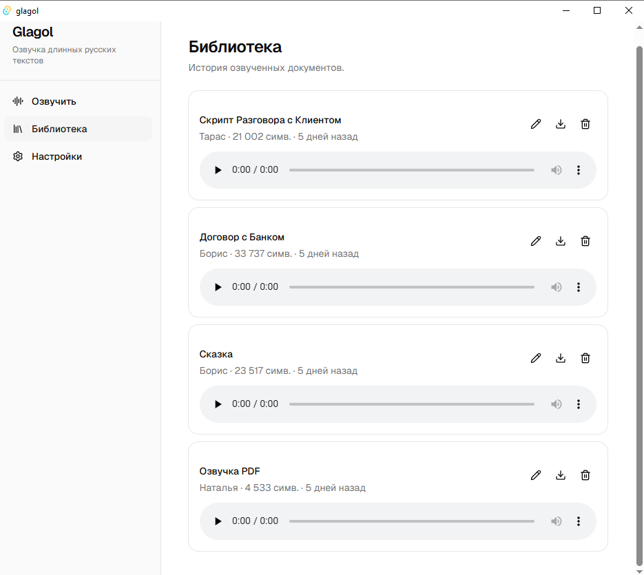

# User Guide — Glagol

Glagol turns long Russian texts into audio. Paste text or load a file — get a recording in a professional voice that you can listen to anywhere: on a walk, on the road, while doing chores.

Built for people who'd rather listen than read off a screen. If you love audiobooks but want to listen to *your own* documents — articles, contracts, books in PDF — Glagol is made for exactly that.

> **Note:** Glagol is Russian-first. Optional local Silero TTS v5.5 is for noncommercial use under CC BY-NC-SA 4.0.

---

## Installation

1. Download the `Glagol_<version>_x64-setup.exe` installer from the [Releases page](../../releases).
2. Run the installer.
3. Windows will show a SmartScreen warning ("Windows protected your PC"). This is normal for new apps without a commercial signing certificate. Click **"More info"** → **"Run anyway"**.
4. Done — Glagol launches automatically.

Glagol's icon is a white microphone on a red-orange background. It appears
on the application, shortcut and idle tray icon; during recording, the tray
switches to a circular red microphone indicator.

**What you need:**
- Windows 10 or 11 (64-bit)
- Allow 1.9 GB of additional free space for optional Silero.
- Internet for downloads; local inference works offline afterwards.

---

## Optional local Silero TTS

Silero TTS v5.5 is **for noncommercial use**, CC BY-NC-SA 4.0, Silero Team.
Dictation and office servers do not require it. Glagol's MIT license and the
selected STT provider's terms apply independently.

1. Settings → “Локальная озвучка — Silero v5.5”.
2. Read the full license and acknowledge noncommercial use.
3. Download and enable: 145.4 MB model + 249.3 MB runtime; allow 1.9 GB free space.
4. Select a voice and use the preview button.

No manual Python, pip or CUDA installation. Download happens only by choice;
subsequent synthesis is offline. If the server is unreachable, choose an exact
previously downloaded `v5_5_ru.pt`. Resume preserves downloaded parts; repair
reinstalls verified components; removal frees space and resets acknowledgement
without removing the library or dictation.

Yandex SpeechKit v3 for commercial TTS is planned later, not included in 0.4.0.
SaluteSpeech and its key are no longer used.

## Your first synthesis

1. Open **Synthesize** (Озвучить).
2. Paste text into the field — or click **"Choose file"** and load a document.
3. Pick a voice.
4. Click **"Synthesize and save to library."**

In a few seconds the finished audio appears in your Library.

Synthesis supports cancellation. Numbers become words; unknown Latin words are spelled out and dates may be read component by component.

**Supported file formats:** `.txt`, `.md`, `.docx`, `.pdf`.

**Voices (5):** Aidar, Baya, Kseniya, Xenia, Eugene.

**Language:** Glagol is made for **Russian text**. Latin script and other languages are "an acquired taste."

**Length:** comfortably handles several thousand characters at once. Large documents (books, long PDFs) are processed in full — the text is automatically split into chunks.

---

## Library

All your recordings live in the Library. Here you can:

- **▶ Play** — built-in player with seeking
- **✏ Rename** — click the pencil, type a new name
- **⬇ Download** — save the WAV file anywhere
- **🗑 Delete** — remove from the library

Documents are sorted newest first. Each shows its voice, character count, and when it was created.

---

## Dictation (voice input)

Glagol also does the reverse — turns your speech into text and inserts it into any application. Hold the hotkey, wait until the microphone is ready, speak, then release — the recognized text appears wherever your cursor is.

When you press the hotkey, the pill first shows **"Подготовка микрофона…" (Preparing microphone)**. Start speaking when the **red dot and audio-level bars** appear: audio is now arriving from the microphone. Preparation may take about a second on some Windows 11 devices. Speech before the microphone is ready is not recorded. Releasing the hotkey during preparation cancels the attempt without transcription. The microphone opens for each dictation and is released when it ends; there is no capture between dictations.

Everything is configured on the **Dictation** (Диктовка) page:

- **Insertion mode** — "Auto-paste" (text is inserted for you, Ctrl+V) or "Clipboard only" (text is placed on the clipboard, you paste it yourself).
- **Hotkey** — `Ctrl+Shift+Space` by default. Click **"Change"** and physically press the combination you want (or type it by hand if it isn't captured). If the combination is taken by another app, the previous hotkey stays active.
- **Microphone** — "System default" or a specific device.
- **History** — **off** by default. Turn it on to keep the last 10 transcripts (the "Copy" button puts a transcript back on the clipboard so you can re-paste something you said earlier). Turning it off stops new lines being written, but what's already there stays visible until you press "Clear history."
- **Total dictated** — a lifetime minute counter.

Under **Settings → Dictation**, choose where recognition runs:

- **On this computer (На этом компьютере).** Choose GigaAM v3 CTC or RNNT and click “Download and use”. Both recognize Russian with punctuation. Each model is about 272–274 MB; the shared engine adds a 20 MB download. Keep at least 500 MB free. Settings shows progress; you can cancel and resume. After verification, dictation works offline. No separate Python or server installation is needed. Currently supported on Windows x64 using the CPU.
- **Organization server (Сервер организации).** Enter the shared server URL, e.g. `http://192.168.1.10:8000/v1`, its model name and an API key if required. `http://localhost:8000/v1` also works. The server must implement OpenAI-compatible `/audio/transcriptions`; `/models` is optional. One server can serve multiple office computers without downloading models to each. Your administrator installs the server itself. HTTP is allowed for localhost and private IPs; it carries audio and keys unencrypted, so use it only on trusted networks. Hostnames require HTTPS with a trusted certificate. System proxies are bypassed in this mode; an explicit proxy can be configured.
- **Cloud service (Облачный сервис).** Choose a preset or enter your own endpoint, model and key. A dictation-only proxy can be configured without a system-wide VPN.

Server and cloud settings and keys are stored separately. Choosing a mode in the list opens its settings; “Save and use” or “Download and use” activates it. When changing endpoints, the old key is not sent to the new service; enter the appropriate key again.

Downloaded models live in `%LOCALAPPDATA%\app.glagol.desktop\speech_models`, separately from the installer and audio library, and survive application updates. Downloads use GitHub and Hugging Face, with size and SHA-256 verification; on-device dictation makes no network requests. Remove unused models from Settings; switch model or mode before removing the active model. “Verify files and repair” repairs a damaged download. The engine package is shared and retained.

The model loads into memory when selected or on the first dictation after launch. Long recordings are split near quiet boundaries into segments of up to 24 seconds; punctuation and rare words may suffer at those boundaries. Check foreign terms manually.

### Known limitations

Dictation runs on top of Windows, which has its own rules. Here's what's worth knowing up front.

1. **A non-text clipboard is lost.** In auto-paste mode Glagol briefly swaps the clipboard for the transcript, then restores the previous contents. If those were an image or files (not text), they can't be restored — they'll be gone from the clipboard.
2. **Clipboard managers that change line endings.** Some clipboard managers "normalize" text (they rewrite line endings). That makes Glagol think someone else changed the clipboard, so out of caution it doesn't restore the previous contents.
3. **Windows run as administrator.** If the active window is elevated (running as administrator) and Glagol isn't, the hotkey won't reach it and you can't dictate into that window. Run Glagol as administrator if you need this regularly.
4. **Noisy surroundings.** The silence threshold is absolute. In a quiet room it rejects silence and lets speech through. In a noisy place (a café, a car), background hum can pass the filter and recognition may produce stray text. Dictate in relative quiet.
5. **Two identical microphones.** If two devices with the same name are connected, Glagol can't tell them apart in the list — the selection may not point to the one you expect.
6. **Win+V and clipboard history.** If Windows clipboard history (`Win+V`) is enabled, every transcript lands in it. You can turn it off in Windows Settings → Clipboard.
7. **`Ctrl+Shift+Space` conflict in Office.** In Microsoft Office that combination inserts a non-breaking space. If you dictate into Office, assign a different hotkey (for example `Alt+Shift+D`) on the Dictation page.

**Log-sending tip:** before attaching logs to a bug report, **close Glagol completely** — on exit it flushes everything still buffered into the log file. Otherwise the last lines may not make it to disk.

---

## Backup and transfer

Glagol can save your entire library (documents + audio files) into a single archive — handy for backups or moving to another computer.

**Create a backup:**
Settings → **"Create backup"** → choose a folder. You get one `.zip` file with everything inside.

**Restore / move to a new computer:**
1. On the new computer, install Glagol and enable optional Silero separately if you need new synthesis.
2. Settings → **"Restore from backup"** → select your `.zip`.
3. Glagol shows what it will replace and asks for confirmation.
4. After restoring, the app restarts — your whole library is back in place.

Before restoring, Glagol automatically creates a backup of the current state — just in case something goes wrong.

---

## If something doesn't work

**Synthesis does not start**
Check Silero installation and acknowledgement in Settings. Repair damaged components, or import the exact downloaded model if its server is unreachable.

**Installer won't run — Windows warning**
That's SmartScreen. "More info" → "Run anyway." See the Installation section.

**A voice sounds odd**
Try another of the five voices — each has its own manner. If you're synthesizing non-Russian text, that won't work well — Glagol is Russian-only.

---

## Feedback

Found a bug or have a suggestion? Open an [Issue](../../issues) on GitHub.

---

## About

I built Glagol for myself, to listen to long texts instead of reading them off a screen. It turned into something worth sharing.

Built together with Claude (Anthropic) — AI as a tool under human control.

Open source, MIT license.
